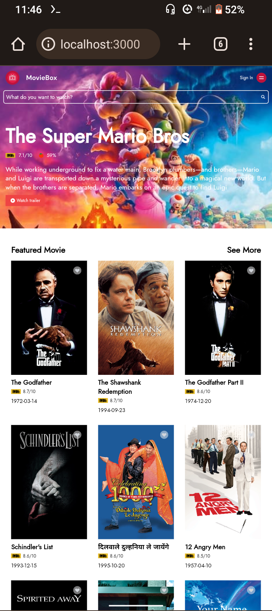

# React TMDB Movie App with Tailwind CSS

##### This is a simple React application that utilizes Tailwind CSS to display movie data fetched from The Movie Database (TMDb) API. With this project, you can quickly set up and run a local development environment to explore and display movie information



## Prerequisites

###### Before you begin, ensure you have met the following requirements:

-  Node.js: Make sure you have Node.js installed. You can download it
   [here](https://nodejs.org/)
-  TMDb API Key: You'll need an API key from TMDb to fetch movie data. You can
   obtain one by signing up at [TMDb
   developer](https://www.themoviedb.org/documentation/api)

## Getting Started

-  Clone this repository to your local machine:

```
git clone https://github.com/habib/muvvies-hngProjectTwo

```

-  Navigate to the project directory:

```
   cd muvvies-hngProjectTwo
```

-  Install project dependencies using npm or yarn:

```
   npm install
   # or
   yarn Install
```

-  Start the development server:

```
   npm run dev
   #or
   yarn run dev
```

-  Open your web browser and visit http://localhost:3000 to see the app in
   action.

## Features

-  View detailed movie information including overview, release date, and rating.
-  Search for movies by title.
-  Responsive design with Tailwind CSS.

## Technologies Used:

-  React: A JavaScript library for building user interfaces.
-  Tailwind CSS: A utility-first CSS framework.
-  Fetch: A promise way of getting API data

## Acknowledgments

-  This project was created as a task by HNG INTERNSHIP frontend task and is not affiliated with
   TMDb.
